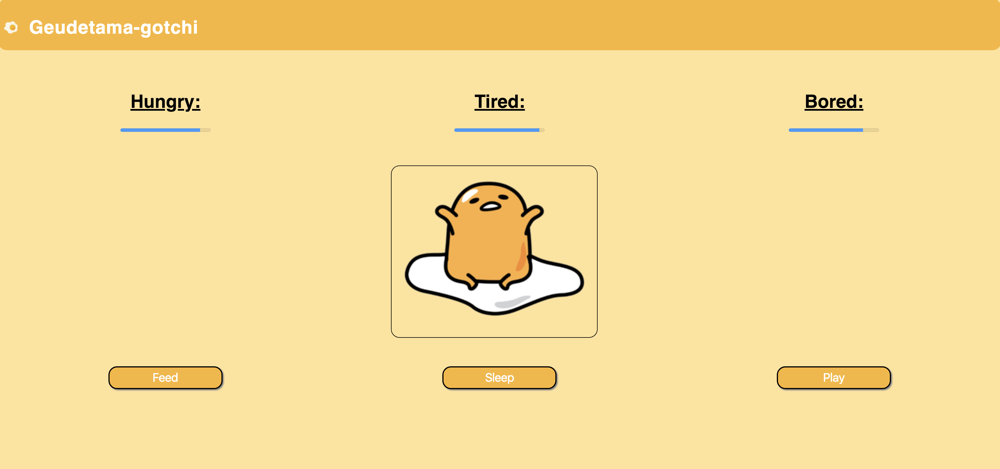

# Geudetama-gotchi

### by [Lew Davidson](https://github.com/lewdavidson) and [Nathan Barrett](https://github.com/nathan-barrett)

#### Description:
A simple web app made using React that allows you to "feed", 'rest', or 'play with' an little egg creature whose levels go down incrementally every 5 seconds.



### Installation instructions:

```
open terminal
$ cd Desktop
$ git clone https://github.com/lewdavidson/Geudetama-gotchi.git
$ cd Geudetama-gotchi
$ npm install
$ heroku local web

visit http://localhost:5000/#/ in the web browser of your choice
```

##### Contact:

Lew Davidson - lewdavidson47@gmail.com
Nathan Barrett - demelues.barrett@gmail.com
